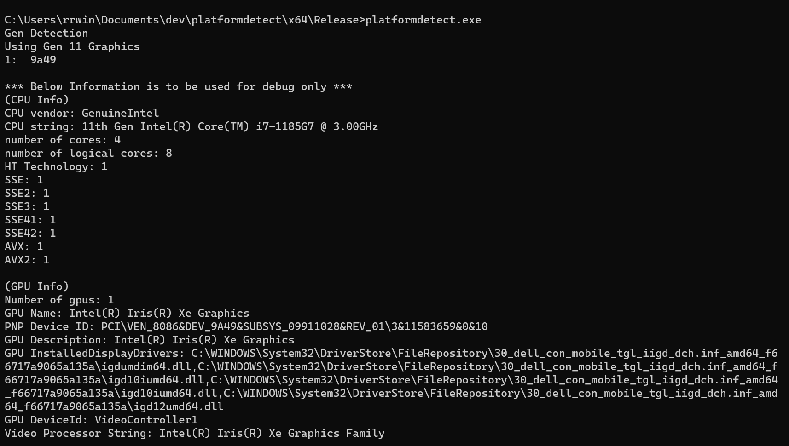

# Platform Detect (platformdetect)
Detects CPU ISA and GPU information

This project can be used to show how to detect specific ISA capabilities from the GPU as well as the CPUID string as well as GPU and Graphics Driver Information.

The following is the executed 64 bit binary output when running the unit test "platformdetect.exe".  The top of the output is the PCI ID that is for the platform presented below in the debug information and unit testing.  

# File Descriptions
README.md - this file  
platformdetect.vcxproj.filters - msvs (2019) file filters  
platformdetect.vcxproj - msvs (2019) project file  
platformdetect.png - example output  
./x64/Release/gen11.txt - file containing some of the gen 11 PCI ID's (TODO: rrw this needs to be completed)  
./x64/Release/platformdetect.exe - windows 64 bit example binary  
./src/cpuinfo.cpp - debug cpu information collection implementation  
./src/cpuinfo.h - debug cpu information collection class  
./src/gpuid.cpp - gpu pci id collection implementation  
./src/gpuid.h - gpu pci id collection class  
./src/gpuinfo.cpp - debug gpu information collection implementation  
./src/gpuinfo.h - debug gpu information collection class  
./src/platformdetect.cpp - unit test example code  